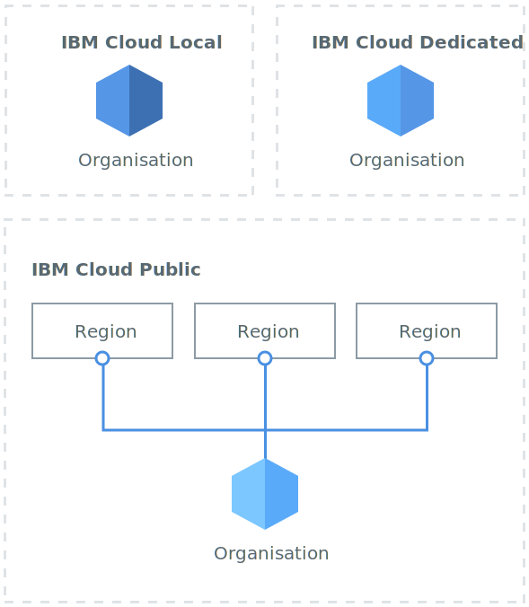
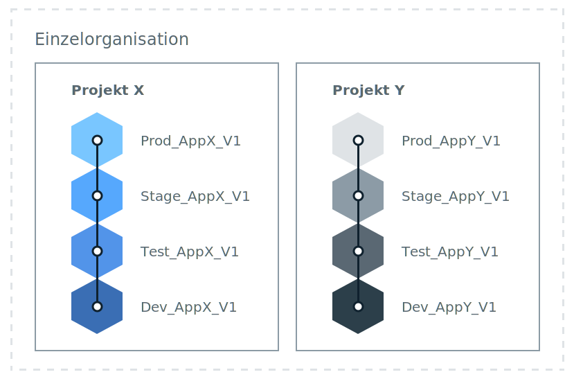

---

copyright:

  years: 2018
lastupdated: "2018-04-13"

---

{:shortdesc: .shortdesc}
{:new_window: target="_blank"}
{:codeblock: .codeblock}
{:pre: .pre}
{:screen: .screen}
{:tip: .tip}

# Organisationsarchitektur bestimmen
{: #orgstructure}

Für den Entwurf einer Umgebung, in der {{site.data.keyword.Bluemix_notm}} Public, {{site.data.keyword.Bluemix_dedicated_notm}}, {{site.data.keyword.Bluemix_local_notm}} oder eine beliebige Kombination dieser Produkte eingesetzt wird, können Sie die folgenden Organisationsarchitekturen verwenden:

* Einzelorganisation: Ziehen Sie diese Architektur in Betracht, wenn dieselbe Gruppe von Benutzern auf Ressourcen zugreifen muss, die an einer beliebigen Stelle in der Organisation in verfügbar sind.
* Mehrere Organisationen: Ziehen Sie diese Architektur in Betracht, wenn eine Isolierung zwischen verschiedenen Umgebungen erforderlich ist.

## Umgebung mit einer Einzelorganisation im Vergleich zu einer Umgebung mit mehreren Organisationen
{: #singleormulti}

In einer Umgebung mit einer Einzelorganisation werden die Infrastrukturressourcen von verschiedenen Bereichen des Unternehmens gemeinsam genutzt. Demgegenüber werden die Infrastrukturressourcen in einer Umgebung mit mehreren Organisationen nicht gemeinsam genutzt.

Beide Organisationsarchitekturen unterstützten die folgenden Prinzipien:

* Abgrenzung für Apps, Projekten oder beides.
* Berechtigungen zur Verwaltung von Ressourcen, die durch Benutzerrollen erteilt werden.

Anschließend können Sie mehrere Bereiche definieren, die auf verschiedenen Geschäftsfeldern (LOB, Lines of Business), Bereitstellungsphasen, bestimmten Projekten, Apps, Benutzerberechtigungen oder einer Kombination dieser Komponenten basieren.

Zum Implementieren einer Architektur mit mehreren Organisationen können Sie Organisationen definieren, die verschiedenen Geschäftsfeldern (LOBs), Bereitstellungsphasen, bestimmten Projekten, Benutzerberechtigungen oder einer Kombination dieser Komponenten entsprechen. Daraufhin können Sie mehrere Bereiche definieren, die auf Apps oder Projekten basieren, die von derselben Abteilung im Unternehmen bereitgestellt werden.

{: tip}

## Organisationsaspekte
{: #orgconsiderations}

Wenn Sie eine Architektur mit einer Einzelorganisation implementieren, enthält die Organisation sämtliche Cloudressourcen, Services und Apps, die Sie zum Entwickeln, Verwalten und Bereitstellen von Cloud-Apps verwenden. In {{site.data.keyword.Bluemix_notm}} Public stellt die Organisation eine Trennung zwischen Konten bereit und ist über alle Regionen hinweg verfügbar.

 

 Abbildung 1. Beispiel für eine Architektur mit Einzelorganisation.
{: #bpfigure1}

Wenn Sie eine Architektur mit mehreren Organisationen implementieren, stellen Organisationen die erste Ebene der Abgrenzung und Abstraktion bereit, die Sie zum Steuern und Definieren der Tätigkeiten und Berechtigungen verwenden können. Entwerfen Sie jede Organisation im Hinblick auf die verschiedenen Geschäftsfelder (LOBs), Bereitstellungsphasen, Rollen der Benutzer, bestimmten Projekte oder im Hinblick auf eine Kombination dieser Komponenten.  

Die Anzahl der Organisationen, die Sie benötigen, hängt von mehreren Faktoren ab:

* Der Unterteilungsgrad, den Sie in Ihrer Organisation zur Verwaltung von Kontingenten und zur Steuerung von Kosten benötigen.
* Die Sicherheitsstufe, die Sie in Ihren verschiedenen Umgebungen umsetzen müssen. Wenn Sie zum Beispiel Container verwenden, kann es sinnvoll sein, für die Entwicklung verwendete Container-Images unter Umständen von den Container-Images zu trennen, die für die Produktionsumgebung verwendet werden.
* Der Standort der Organisation wegen der Anforderungen, die für das Unternehmen, das Land und die Branche berücksichtigt werden müssen. Sie können zum Beispiel alle Apps in einer Umgebung ausführen, die sich in einer bestimmten Region einer Ländergruppe (geo) befindet.

Beachten Sie bei der Definition der verschiedenen Organisationen für die Cloud-Struktur die folgenden Hinweise:

* Definieren Sie eine Namenskonvention und machen Sie ihre Verwendung verbindlich. Definieren Sie zum Beispiel eine Namenskonvention, bei der der Name der Organisation Informationen zum Geschäftsbereich, zum Typ der Cloud und zur Prozessphase (Entwicklung, Test oder Produktion) enthält. Für Organisationen, die sich in {{site.data.keyword.Bluemix_notm}} Public befinden, können Sie auch Informationen zur Region hinzufügen.
* Definieren Sie die Einschränkungen, die für die Organisation gelten. Definieren Sie zum Beispiel die Rolle der Teammitglieder, die in dieser Organisation arbeiten.
* Geben Sie den Manager der Organisation an.
* Geben Sie den Geschäftsbereich an, der dieser Organisation zugeordnet ist.

Die folgenden Szenarios zeigen verschiedene Ansätze, die Sie verfolgen können, wenn Sie die Anzahl der Cloud Foundry-Organisationen in einer Umgebung definieren:

### Szenario 1: Trennung von Benutzergruppen nach der Bereitstellung von Geschäftsanwendungen

 Beschreibung: Im Unternehmen festgelegte Regeln sehen vor, dass die Apps jedes Geschäftsfelds (LOB) jeweils von Benutzern dieser Geschäftsfelder entwickelt, verwaltet und bereitgestellt werden sollen. Sicherheitsmaßnahmen müssen eingerichtet werden, sodass Benutzer nur auf die Apps zugreifen können, die für ihren Teil des Geschäfts relevant sind. Das heißt, die Benutzer arbeiten in verschiedenen Geschäftsbereichen und die Apps, an denen sie arbeiten, erfordern Zugriff auf verschiedene {{site.data.keyword.Bluemix_notm}}-Ressourcen, und es gibt keine Überschneidung von Aktivitäten.

  Lösung: Sie können eine Organisation für jeden Bereitstellungsprozess von Geschäftsanwendungen erstellen. Zum Beispiel eine Organisation für das Privatkundengeschäft (Einzelhandel) einer Bank und eine Organisation für das Investment Banking der Bank.

  

  Abbildung 2. Beispiel für eine Architektur mit mehreren Organisationen, die sich an der Bereitstellung durch Geschäftsfelder orientiert
{: #bpfigure2}

### Szenario 2: Trennung nach Benutzertyp (interne Benutzer, externe Benutzer)

  Beschreibung: Ihr Unternehmen arbeitet mit verschiedenen Partnern zusammen und benötigt eine klare Abgrenzung von internen und externen Benutzern.

  Lösung: Sie können eine Organisation zur Bereitstellung von Apps erstellen, die intern verwendet werden. Zusätzlich können Sie eine Organisation für jeden externen Partner erstellen.

### Szenario 3: Isolierung nach Projekt

  Beschreibung: Ihr Unternehmen führt Hackathons zur Erkundung neuer Services durch.  

  Lösung: Sie können eine Organisation pro Hackathon definieren und die Organisation als Sandbox nutzen. Nach dem Hackathon können Sie die Sandbox-Organisation in eine weitere Organisation in Ihrem Konto umstufen.

### Szenario 4: Isolierung von Benutzern nach Bereitstellungsphase

  Beschreibung: Ein Unternehmen möchte, dass Entwicklungs-, Test- und Produktionsbenutzer über die Bereitstellung hinweg zusammenarbeiten, wobei der Zugriff dieser Benutzer durch ihre Rolle und ihre Berufserfahrung gesteuert werden soll.

  Lösung: Sie können eine Einzelorganisation erstellen und einen Bereich für jede Bereitstellungsphase definieren. Anschließend können Sie den Benutzern abhängig von ihrer Rolle und Berufserfahrung den Lese- und Schreibzugriff erteilen, den Sie zur Erfüllung ihrer Aufgaben und zur Zusammenarbeit innerhalb der Organisation benötigen.

  

   Abbildung 3. Beispiel für eine Architektur mit Einzelorganisation, die sich an den Bereitstellungsphasen orientiert
{: #bpfigure3}

## Benennung, Einschränkungen und Verwaltung von Organisationen
{: #orgadmin}   

Beachten Sie die folgenden Hinweise für Organisationen:

* Definieren Sie eine Namenskonvention und machen Sie sie verbindlich. Definieren Sie zum Beispiel eine Namenskonvention, bei der der Name der Organisation Informationen zum Geschäftsbereich, zum Typ der Cloud und zur IT-Rolle (Entwicklung, Test oder Produktion) enthält. Für Organisationen, die sich in {{site.data.keyword.Bluemix_notm}} Public befinden, können Sie auch Informationen zur Region hinzufügen. Sie können den Namen einer Organisation ändern, nachdem er erstellt wurde. Wenn ein Organisationsname geändert wird, müssen Sie alle Teammitglieder der Organisation darüber informieren.
* Definieren Sie die Einschränkungen, die für die Organisation gelten. Definieren Sie zum Beispiel die Rolle jedes Teammitglieds und die Berechtigungen, die diese zur Arbeit in der Organisation benötigen.
* Geben Sie den Manager der Organisation an. Es kann sinnvoll sein, die Verwaltung einer Organisation an mehrere Personen zu delegieren.
* Geben Sie den Geschäftsbereich an, der dieser Organisation zugeordnet ist. Die Anwendungsnutzung, die in jedem der Bereiche innerhalb der Organisation generiert wird, wird auf Organisationsebene summiert und gemeldet.
