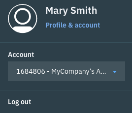

---

copyright:
  years: 2018
lastupdated: "2018-07-17"

---

{:shortdesc: .shortdesc}
{:new_window: target="_blank"}
{:codeblock: .codeblock}
{:pre: .pre}
{:screen: .screen}
{:tip: .tip}

# Konto vorbereiten
{: #prepare}

CFEE-Instanzen werden auf Infrastrukturressourcen (Kubernetes-Workerknoten des IBM Container-Service) bereitgestellt, die für das IBM Cloud-Konto abgerechnet werden. Dies bedeutet, dass das IBM Cloud-Konto, unter dem die CFEE-Instanz erstellt wird, ein gebührenpflichtiges Konto sein muss (ein nutzungsabhängiges Konto oder ein Abonnementkonto).  Falls das IBM Cloud-Konto, unter dem Sie eine CFEE-Instanz erstellen möchten, ein Testkonto ist, werden Sie bei dem Versuch eine CFEE-Instanz zu erstellen, aufgefordert, ein Upgrade für das Konto durchzuführen.  Wenn für ein IBM Cloud-Konto ein Upgrade durchgeführt wird (von einem Testkonto auf ein nutzungsabhängiges Konto oder ein Abonnementkonto), wird das IBM Cloud-Konto mit einem SoftLayer-Konto verknüpft (über das Infrastrukturressourcen erstellt werden können). Weitere Informationen finden Sie unter [Kontotypen](https://console.bluemix.net/docs/account/index.html#accounts). Die Kosten für diese Infrastrukturressourcen werden in Ihrer IBM Cloud-Rechnung angezeigt.

## Methode zum Feststellen, ob vom IBM Cloud-Konto CFEE-Instanzen erstellt werden können
{: #account-check}

Sie können feststellen, ob ein IBM Cloud-Konto ein Testkonto oder ein gebührenpflichtiges Konto ist, und ob es mit einem SoftLayer-Konto verknüpft ist, wenn Sie die Kontoinformationen in der rechten oberen Ecke des IBM Cloud-Banners anzeigen.

Im folgenden Beispiel wird der Benutzer _Mary Smith_ am IBM Cloud-Konto _MyCompany_ angemeldet, bei dem es sich um ein Testkonto handelt. 

Im Beispiel darunter wurde für dasselbe IBM Cloud-Konto _MyCompany_ ein Upgrade auf ein kostenpflichtiges Konto durchgeführt.  Aufgrund des Upgrades ist das Konto nun mit dem SoftLayer-Konto _1684806_ verknüpft.  Beide Konten werden im Feld 'Konto: angezeigt. 

Falls das IBM Cloud-Konto ein Testkonto ist, werden Sie bei dem Versuch eine CFEE-Instanz zu erstellen, aufgefordert, ein Upgrade für das Konto durchzuführen. Informationen hierzu finden Sie in der nachfolgenden Anzeige:

## SoftLayer-Konto verwenden anstatt Upgrade für IBM Cloud-Konto durchführen
{: #account-linkswitching}

Wenn Sie in einem IBM Cloud-Konto über eine Administratorrolle verfügen, können Sie ein SoftLayer-Konto verwenden, um die CFEE-Instanz ohne Durchführung eines Upgrades für das IBM Cloud-Konto zu erstellen.

**Warnung:** Wenn Sie jetzt ein SoftLayer-Konto verwenden und das IBM Cloud-Konto in der Zukunft aktualisieren (auf ein kostenpflichtiges Konto oder Abonnementkonto), kann von der aktualisierten IBM Cloud weiterhin das SoftLayer-Konto verwendet werden (dessen Berechtigungsnachweise Sie jetzt festgelegt haben), wenn Sie zukünftige Infrastrukturressourcen erstellen. Wenn Sie in der Zukunft ein anderes SoftLayer-Konto für die Erstellung von Cloud Foundry Enterprise Environment-Umgebungen verwenden, können Benutzer im IBM Cloud-Konto möglicherweise nicht auf Infrastrukturressourcen zugreifen, die unter dem SoftLayer-Konto erstellt wurden, dessen Berechtigungsnachweise Sie jetzt festgelegt haben. Es wird empfohlen, stattdessen ein Upgrade für das IBM Cloud-Konto durchzuführen.

Gehen Sie wie folgt vor, um ein SoftLayer-Konto zu verwenden, ohne ein Upgrade für das IBM Cloud-Konto durchzuführen (Informationen hierzu finden Sie in der folgenden Abbildung):
1. Klicken Sie in der Anzeige, die angezeigt wird, wenn für das IBM Cloud-Konto kein Upgrade durchgeführt wurde, auf **SoftLayer-Konto verwenden**.
2. Geben Sie unter **Benutzername** und **API-Schlüssel** die entsprechenden Angaben des SoftLayer-Kontos ein. Zum Abrufen des Benutzernamens und API-Schlüssel für das SoftLayer-Konto greifen Sie auf die [SoftLayer-Konsole](https://control.softlayer.com) zu. Wenn Sie sich an SoftLayer angemeldet haben, wählen Sie das Konto aus, das Sie mit dem {{site.data.keyword.Bluemix_notm}}-Konto verknüpfen möchten. Wenn Sie das Konto auswählen, wird die Profilseite des Kontos geöffnet. Blättern Sie zum Suchen des Benutzernamens und API-Schlüssels für das Konto abwärts bis zum Ende der Seite. Falls kein API-Schlüssel vorhanden ist, können Sie ihn generieren, sofern Sie der Kontoeigner sind. Wenn Sie nicht der Kontoeigner sind, bitten Sie den Kontoeigner, ihn zu generieren.
3. Klicken Sie auf **Berechtigungsnachweise festlegen**.

**Hinweis:** Sie müssen über ausreichende Berechtigungen für das SoftLayer-Konto verfügen, um einen regulären Kubernetes-Cluster aus dem IBM Container-Service erstellen zu können. Wenn dies nicht der Fall ist, wenden Sie sich an den SoftLayer-Kontoadministrator oder an den Benutzer, der Ihnen Zugriff auf das SoftLayer-Konto erteilt hat, um Ihnen diese zusätzlichen Berechtigungen zu erteilen.
