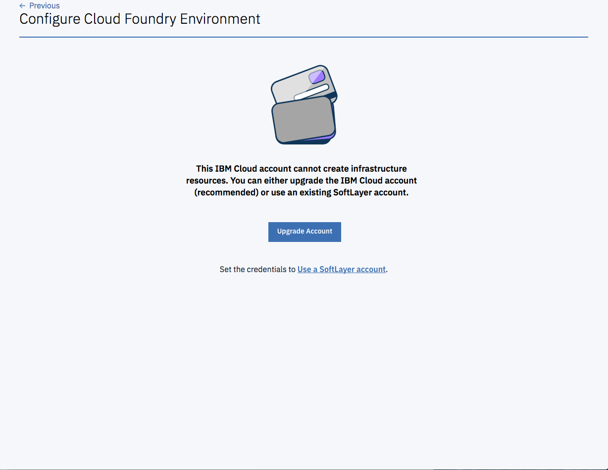

---

copyright:
  years: 2018
lastupdated: "2018-07-17"

---

{:shortdesc: .shortdesc}
{:new_window: target="_blank"}
{:codeblock: .codeblock}
{:pre: .pre}
{:screen: .screen}
{:tip: .tip}

# Préparation de votre compte
{: #prepare}

Les instances CFEE sont déployées dans des ressources d'infrastructure (noeuds worker Kubernetes issus du service de conteneur IBM) qui sont facturées au compte IBM Cloud. Cela signifie que le compte IBM Cloud sous lequel l'instance CFEE est créée doit être un compte payant (paiement à la carte ou compte d'abonnement).  Si le compte IBM Cloud sous lequel vous prévoyez de créer une instance CFEE est un compte d'essai, vous devrez convertir le compte lorsque vous voudrez créer une instance CFEE.  Lorsqu'un compte IBM Cloud est mis à niveau (depuis un compte d'essai vers un compte de paiement à la carte ou d'abonnement), il est lié à un compte SoftLayer (par le biais duquel des ressources d'infrastructure peuvent être créées). Pour plus d'informations, voir [Types de compte](https://console.bluemix.net/docs/account/index.html#accounts). Le coûts de ces ressources d'infrastructure apparaissent sur votre facture IBM Cloud.

## Comment déterminer si le compte IBM Cloud peut créer des instances CFEE
{: #account-check}

Vous pouvez déterminer si un compte IBM Cloud est un compte d'essai ou payant, et s'il est lié à un compte SoftLayer, en consultant les informations relatives au compte dans l'angle supérieur droit de la bannière IBM Cloud.

Dans l'exemple suivant, l'utilisateur _Mary Smith_ est connecté au compte IBM Cloud _MyCompany_, qui est un compte d'essai.

Dans l'exemple suivant, le même compte IBM Cloud _MyCompany_ a été transformé en compte payant.  Le compte est désormais lié au compte SoftLayer _1684806_.  Les deux comptes s'affichent dans la zone "Compte".

Si le compte IBM Cloud est un compte d'essai, vous serez invité à le mettre à niveau lorsque vous essayez de créer une instance CFEE. Observez l'écran illustré ci-dessous :

## Utilisation d'un compte SoftLayer au lieu d'une mise à niveau du compte IBM Cloud
{: #account-linkswitching}

Si vous détenez le rôle d'administrateur sur un compte IBM Cloud, vous pouvez utiliser un compte SoftLayer pour créer l'instance CFEE sans mettre à niveau le compte IBM Cloud.

**Avertissement :** si vous utilisez maintenant un compte SoftLayer et que vous effectuez ultérieurement une mise à jour du compte IBM Cloud (vers un compte Paiement à la carte ou Abonnement), le compte IBM Cloud mis à jour risque de continuer à utiliser le compte Softlayer (dont vous définissez ici les données d'identification) lors des futures créations de ressources d'infrastructure. De plus, si vous utilisez ultérieurement un autre compte SofLayer pour créer des environnements Cloud Foundry Enterprise, les utilisateurs du compte IBM Cloud risquent de ne pas pouvoir accéder aux ressources d'infrastructure créées sous le compte SoftLayer dont vous définissez ici les données d'identification. Nous vous recommandons de plutôt mettre à niveau le compte IBM Cloud.

Pour utiliser un compte SoftLayer sans mettre à niveau le compte IBM Cloud (voir écran d'illustration ci-dessous) :
1. Dans l'écran affiché lorsque le compte IBM Cloud n'a pas été mis à niveau, cliquez sur **Utiliser un compte Softlayer**.
2. Entrez les valeurs **Nom d'utilisateur** et **Clé d'API** concernant un compte SoftLayer. Pour obtenir le nom d'utilisateur et la clé d'API de SoftLayer, accédez à la [console SoftLayer](https://control.softlayer.com). Une fois connecté à SoftLayer, sélectionnez le compte que vous voulez lier au compte {{site.data.keyword.Bluemix_notm}}. La sélection d'un compte ouvre la page de profil du compte. Faites défiler jusqu'à la fin de la page pour trouver le nom d'utilisateur et la clé d'API du compte. Si vous n'avez pas de clé d'API, vous pouvez la générer si vous êtes propriétaire du compte. Si vous n'êtes pas propriétaire du compte, demandez à son propriétaire de la générer.
3. Cliquez sur **Définir des données d'identification**.

**Remarque :** vous devez disposer de droits d'accès suffisants dans le compte SoftLayer pour créer un cluster Kubernetes ordinaire à partir du service de conteneur IBM. Si tel n'est pas le cas, demandez à l'administrateur de compte SoftLayer ou à l'utilisateur qui vous a donné accès au compte SoftLayer de vous accorder ces droits supplémentaires.
