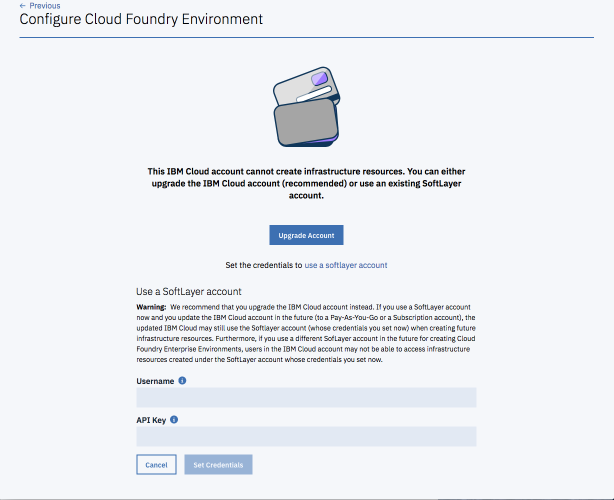

---

copyright:
  years: 2018
lastupdated: "2018-07-17"

---

{:shortdesc: .shortdesc}
{:new_window: target="_blank"}
{:codeblock: .codeblock}
{:pre: .pre}
{:screen: .screen}
{:tip: .tip}

# Preparazione del tuo account
{: #prepare}

Le istanze CFEE vengono distribuite sulle risorse dell'infrastruttura (i nodi di lavoro di Kubernetes dal servizio IBM Container) che vengono fatturati all'account IBM Cloud. Ciò significa che l'account di IBM Cloud in cui viene creata l'istanza CFEE deve essere un account a pagamento (un account Sottoscrizione o Pagamento a consumo).  Se l'account IBM Cloud in cui vuoi creare un'istanza CFEE è un account di prova, ti sarà richiesto di eseguire l'upgrade dell'account quando tenti di creare un'istanza CFEE.  Quando viene eseguito l'upgrade di un account IBM Cloud (da un account di prova a un account Pagamento a consumo o Sottoscrizione), l'account IBM Cloud viene collegato a un account SoftLayer (tramite il quale è possibile creare le risorse dell'infrastruttura). Per ulteriori informazioni, consulta [Tipi di account](https://console.bluemix.net/docs/account/index.html#accounts). Il costo di queste risorse di infrastruttura viene visualizzato nella tua fattura IBM Cloud.

## Come determinare se l'account IBM Cloud può creare istanze CFEE
{: #account-check}

Puoi determinare se un account IBM Cloud è un account di prova o a pagamento e se è collegato a un account SoftLayer, esaminando le informazioni sull'account nell'angolo in alto a destra del banner di IBM Cloud.

Nel seguente esempio _Mary Smith_ è collegata all'account IBM Cloud _MyCompany_, che è un account di prova.

Nel seguente esempio, lo stesso account IBM Cloud _MyCompany_ è stato aggiornato a un account a pagamento.  Come risultato dell'upgrade, l'account è ora collegato all'account SoftLayer _1684806_.  Entrambi gli account vengono visualizzati nel campo "Account".

Se l'account IBM Cloud è un account di prova, ti verrà richiesto di eseguirne l'upgrade quando tenti di creare un'istanza CFEE. Consulta la seguente schermata:

## Utilizzo di un account SoftLayer invece di eseguire l'upgrade dell'account IBM Cloud
{: #account-linkswitching}

Se hai il ruolo di amministratore in un account IBM Cloud, puoi utilizzare un account SoftLayer per creare l'istanza CFEE senza eseguire l'upgrade dell'account IBM Cloud.

**Avvertenza:** se utilizzi un account SoftLayer adesso e aggiorni l'account IBM Cloud in futuro (a un account Pagamento a consumo o Sottoscrizione), l'account IBM Cloud aggiornato può ancora utilizzare l'account Softlayer (le cui credenziali sono state impostate ora) durante la creazione di risorse dell'infrastruttura future. Inoltre, se utilizzi un account SofLayer diverso in futuro per la creazione di Cloud Foundry Enterprise Environment, gli utenti nell'account IBM Cloud potrebbero non essere in grado di accedere alle risorse dell'infrastruttura create nell'account SoftLayer le cui credenziali sono state impostate ora. Si consiglia, invece, di eseguire l'upgrade dell'account IBM Cloud.

Per utilizzare un account SoftLayer senza eseguire l'upgrade dell'account IBM Cloud (consulta la seguente schermata per le istruzioni):
1. Nella schermata mostrata quando l'account IBM Cloud non viene aggiornato, fai clic su **Use a SoftLayer account**.
2. Immetti i valori **Username** e **API Key** da un account SoftLayer. Per ottenere il nome utente e la chiave API di SoftLayer, accedi alla [console SoftLayer](https://control.softlayer.com). Dopo aver effettuato l'accesso a SoftLayer, seleziona l'account che vuoi collegare all'account {{site.data.keyword.Bluemix_notm}}. Selezionando l'account si apre la pagina del profilo dell'account. Scorri verso il basso fino alla fine della pagina per trovare il nome utente e la chiave API dell'account. Se non hai una chiave API, puoi generarla se sei il proprietario dell'account. Se non sei il proprietario dell'account, chiedi al proprietario dell'account di generarla.
3. Fai clic su **Set credentials**.

**Nota:** devi disporre di autorizzazioni sufficienti nell'account SoftLayer per creare un cluster Kubernetes regolare dal servizio IBM Container. Se non le hai, chiedi all'amministratore dell'account SoftLayer o all'utente che ti ha concesso l'accesso all'account SoftLayer di concederti tali ulteriori autorizzazioni.
