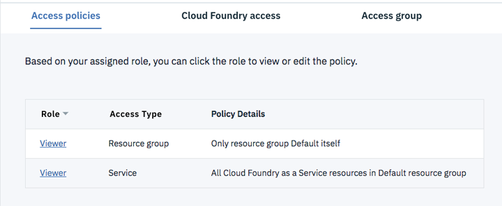

---

copyright:

  years: 2015, 2017, 2018

lastupdated: "2018-04-18"

---

{:shortdesc: .shortdesc}
{:new_window: target="_blank"}
{:codeblock: .codeblock}
{:pre: .pre}
{:screen: .screen}
{:tip: .tip}

# 許可
{: #permissions}

ユーザーが {{site.data.keyword.cfee_full}} サービスのインスタンスを作成して作業を開始する前に、インスタンスが作成されるアカウントの管理者によって、ユーザーの許可が正しく設定される必要があります。 

## 新しい環境を作成するために必要な許可
{: #perm-creating}

CFEE サービスの新規インスタンスを作成するためには、CFEE サービス自体に対するアクセス・ポリシーだけではなく、CFEE 作成時に自動的に作成されるサポート・サービスに対するアクセス・ポリシーも、アカウント管理者によってユーザーに付与される必要があります。

ユーザーが {{site.data.keyword.cfee_full_notm}} インスタンスを作成できるためには、以下の ID およびアクセス管理 (IAM) アクセス・ポリシーが必要です。

* {{site.data.keyword.Bluemix}} アカウント内の**_デフォルト_** の**リソース・グループ**に対する_ビューアー_ (またはそれ以上) のアクセス権限。リソース・グループでは、リソースへのアクセス制御を可能にするために、それらのリソースをカスタマイズされたグループに編成できます。 新規環境インスタンスを作成するときに、リソース・グループに関するプロンプトが出されます。_デフォルト_ のリソース・グループに対するアクセス権限が必要なのは、常にこのリソース・グループでは Kubernetes クラスターが必要であるためです。ユーザーは異なるリソース・グループに CFEE インスタンスをプロビジョンできますが、その場合でも Kuberetes クラスターは_デフォルト_ のリソース・グループにプロビジョンされます。ユーザーが異なるユーザー・グループに CFEE をプロビジョンする場合、そのユーザーにはそのリソース・グループ内でビューアーのアクセス権限が必要になります。

* 環境が割り当てられているリソース・グループ内の **{{site.data.keyword.cfee_full_notm}} サービス**のリソースに対する管理者またはエディターの役割。{{site.data.keyword.cfee_full_notm}} サービス内の管理者またはエディターの役割を持つユーザーは、環境を作成および削除できます。 ただし、{{site.data.keyword.cfee_full_notm}} インスタンスにユーザーを割り当てたり、そのインスタンス内のユーザーに割り当てられている役割を変更したりできるのは、管理者役割を持つユーザーのみになります。
   
* **Kubernetes サービス**のリソースに対する管理者役割。{{site.data.keyword.cfee_full_notm}} のインスタンスは、Kubernetes サービスによって提供されるコンテナー・クラスター・インフラストラクチャーにデプロイされます。{{site.data.keyword.cfee_full_notm}} サービスのインスタンスを作成すると、サービスは自動的に Kubernetes クラスターを作成します。そのクラスター・インフラストラクチャーを作成するためには、Kubernetes サービスに対するアクセス権限が必要です。Kubernetes サービスに対するアクセス権限ポリシーの適用範囲を、CFEE インスタンスをプロビジョンする予定の特定の地域に限定することも、すべての地域にアクセス権限を適用することもできます。

* CFEE サービスの必須の従属関係である **IBM Cloud オブジェクト・ストレージ・サービス**に対する管理者またはエディターの役割。IBM Cloud オブジェクト・ストレージ・サービスのインスタンスは、ICFEE アプリケーション・コンテナーの作成中に生成されるデータ (例えば、アップロードされたアプリケーション・パッケージ、ビルドパック、およびコンパイルされた実行可能プログラムなど) を保管するために使用されます。

* Compose for PostgreSQL サービスのインスタンスは、CFEE サービスの必須の従属関係です。  Compose for PostgreSQL は、Cloud Foundry データ (例えば、アプリケーション・デプロイメント (開始イベントと停止イベント) の監査、CFEE ユーザー・メンバーシップ、組織、スペース、アプリケーション、およびサービス接続の記録) を CFEE インスタンスに保管するために使用されます。  **Compose for PostgreSQL サービス**のそのインスタンスは、{{site.data.keyword.cfee_full_notm}} インスタンスの作成時に選択する、パブリック Cloud Foundry 組織 (CFEE 組織とは無関係) 内のスペースにデプロイされます。これは、{{site.data.keyword.cfee_full_notm}} インスタンスを作成するときに、CFEE インスタンスをプロビジョンしようとしているロケーションの最低でも 1 つの組織に対してマネージャーのアクセス権限を持っている必要があることを意味します。また、その組織内の少なくとも 1 つのスペースに対する開発者のアクセス権限も必要です。 

  CFEE インスタンスを作成する予定のロケーション内のどのパブリック組織のメンバーでもない場合、自身をいずれかの組織に招待してもらうよう IBM Cloud 管理者に依頼してください。アカウント内で管理者の役割をお持ちの場合は、以下を実行することによって、アカウント内のパブリック組織およびスペースにユーザーを追加できます。

     * [**「管理」 > 「アカウント」 > 「Cloud Foundry の組織」**](https://console.bluemix.net/account/organizations)と進み、**「組織の追加」**をクリックするか、既存の組織を選択します。
     * 組織のページの上部にある**「ユーザー」**タブに移動します。
     * CFEE インスタンスを作成する必要があるユーザーを見つけます。CFEE インスタンスを作成できるようにしたいユーザーがリストに含まれていない場合は、表の上の**「ユーザーの追加または招待」**をクリックして、ユーザーを組織に追加または招待します。
     * 組織のページの上部にある**「スペース」**タブに移動します。
     * Compose for PostgreSQL サービスのインスタンスがプロビジョンされるスペースを見つけて、**「開発者」**役割のチェック・ボックスにチェック・マークを付けます。

以下の画面は、ユーザーが {{site.data.keyword.cfee_full_notm}} インスタンスを作成することを許可する、{{site.data.keyword.Bluemix_notm}} の「ID およびアクセス」ページに表示されるアクセス・ポリシーを示しています。

{{site.data.keyword.cfee_full_notm}} インスタンスを作成するために必要なアクセス・ポリシーがあることを確認するには、以下のようにします。
1. {{site.data.keyword.Bluemix_notm}} ヘッダーで[**「管理」>「アカウント」>「ユーザー」**](https://console.bluemix.net/iam/#/users)メニューに移動して、**「ID およびアクセス」**ページを開きます。
2. 「アクセス・ポリシー」タブで、環境を作成するユーザーをクリックして、そのユーザーのアクセス・ポリシーの割り当ておよび表示を行います。

## 環境の処理を行うために必要な許可
{: #perm-working}

{{site.data.keyword.cfee_full_notm}} のインスタンスの処理を行う場合、ユーザーには以下の条件があります。
1. {{site.data.keyword.cfee_full_notm}} インスタンスが作成された {{site.data.keyword.Bluemix_notm}} アカウントのメンバーでなければならない。
2. アカウント管理者によって以下の IAM _アクセス・ポリシー_ が付与されていなければならない ({{site.data.keyword.Bluemix_notm}} ヘッダーの[**「管理」>「アカウント」>「ユーザー」**](https://console.bluemix.net/iam/#/users)メニューの下の_「ID およびアクセス」_ページを参照して、現行アカウントのアクセス・ポリシーを確認してください)。

  - 環境インスタンスが作成されたリソース・グループ内の {{site.data.keyword.cfee_full_notm}} サービスに対するアクセス権限。ユーザーが {{site.data.keyword.cfee_full_notm}} インスタンスに持っているアクセス・レベルおよび制御レベルは、アクセス・ポリシーで付与されている役割によって決まります。
     - 管理者またはエディターの役割を割り当てられているユーザーは、組織を作成し、組織およびスペースに管理者を割り当て、環境内のすべての組織およびスペースへの完全許可を持ち、Cloud Controller API を使用して操作アクションを実行できる。 これらのユーザーには、Cloud Foundry の_「ユーザー・アカウントおよび認証スコープ」_で _cloud_controller.admin scope_ が自動的に付与されます。
     - ビューアーの役割が割り当てられたユーザーは、メインの {{site.data.keyword.Bluemix_notm}} ダッシュボードでその環境を表示し、そのユーザー・インターフェースを開くことができる。 環境内の特定の組織およびスペースへのユーザー・アクセス権限は、それらの組織およびスペースの管理者によって割り当てられる特定の組織およびスペースの役割で管理されます。 詳しくは、[組織へのユーザーの追加](add-users.html)を参照してください。

イメージは、{{site.data.keyword.cfee_full_notm}} にアクセスするために必要な最小アクセス・ポリシー ({{site.data.keyword.Bluemix_notm}} の_「ID およびアクセス」_ページに表示される) を示しています。

