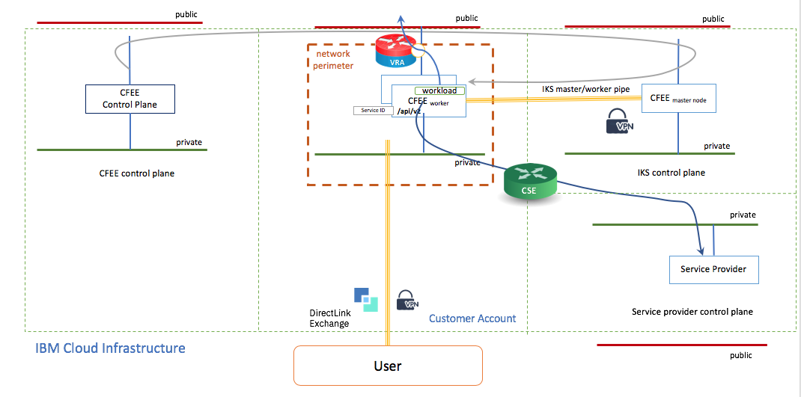

---

copyright:
  years: 2017, 2018
lastupdated: "2019-04-02"

---

{:shortdesc: .shortdesc}
{:new_window: target="_blank"}
{:codeblock: .codeblock}
{:pre: .pre}
{:screen: .screen}
{:tip: .tip}

# 在隔離網路中運作
{: #isolated-network}


從 2.2.0 版開始，{{site.data.keyword.cfee_full}} (CFEE) 實例可以在隔離網路內運作，用於保護環境免於發生外部威脅。您可以透過專用 VLAN 來建立隔離網路，以及透過一組控制機制來遞送、過濾及保護進出周邊網路內資源的資料流量。隔離網路是使用 Virtual Router Appliance ([VRA](https://cloud.ibm.com/docs/infrastructure/virtual-router-appliance?topic=virtual-router-appliance-getting-started-with-ibm-virtual-router-appliance#vlans-and-the-gateway-appliance-s-role)) 這類技術所設定的。 

**附註：**在隔離網路中運作的 CFEE 實例，必須將 CFEE Kubernetes 叢集更新為 1.13 版。更新 Kubernetes 叢集 1.13 版與 CFEE 更新無關。

CFEE 實例會從 IBM Kubernetes Service 佈建至叢集。應用程式管理所在的 CFEE Cloud Foundry Cell 會佈建至「叢集」的工作者節點。這表示對 CFEE Cell 及應用程式的存取權會隱含地存取叢集工作者節點。 

工作者節點包含將應用程式工作負載配送至各工作者節點的「應用程式負載平衡器 (ALB)」。CFEE 2.2.0 版會在專用及公用網路中啟用 Kubernetes ALB。這表示可以從公用或專用網路存取 CFEE 2.2.0 版。

## 隔離網路中的 CFEE 管理
{: #control-plan-access}

在 2.2.0 版中，CFEE 管理平面（用於佈建、更新項目及其他生命週期活動的子系統）不會直接依賴 ALB 或工作者節點來管理 CFEE 實例。相反地，CFEE 管理平面會使用 _Kubernetes 主節點與工作者節點之間的 VPN 連線_ 來存取 CFEE 實例及其資源。這可讓管理平面控制 CFEE 實例。

在您建立 CFEE 實例之後，管理平面會在您的帳戶中建立提供給 IKS 主節點的 [IAM 服務 ID](https://cloud.ibm.com/docs/overview/whats-new?topic=overview-whatsnew#identity-and-access-management-application-authentication-feature)。CFEE 管理平面會使用此服務 ID 透過主節點及其 VPN 存取權來存取 CFEE 主機工作者節點，以進行後續佈建及管理作業（包括部署 CFEE 的主要 Cloud Foundry 元件）。

下圖描述在 VRA 周邊網路後面安裝的 CFEE。   


## 控制對隔離網路中 CFEE 實例的存取
{: #oppening-access-points}

CFEE 實例中執行的 CF 應用程式經常因各種原因而需要到達隔離網路外部。例如，應用程式可能需要存取公用 RESTful 服務，或從公用登錄下載套件（例如 Docker 映像檔、NPM 套件、Python 模組等）。因此，您需要配置防火牆規則，來啟用特定的網路存取需求。

您可以藉由配置特定通訊協定、來源或目標端點的規則，來控制進出隔離網路的入埠/出埠連線功能。您可以在用來設定周邊網路的特定技術（例如 VRA）中使用控制機制，來建立及配置這些項目。不過，此作業的最簡單控制方式是建立 [Calico 網路原則](https://docs.projectcalico.org/v3.4/reference/calicoctl/resources/globalnetworkpolicy)，以定義專用於主機 Kubernetes 叢集的網路規則。如需逐步指引，請參閱[建立及套用 Calico 網路原則](https://cloud.ibm.com/docs/containers?topic=containers-network_policies#adding_network_policies)。

與網路隔離 CFEE 相關的網路存取規則可以是下列類型：

* **入埠資料流量存取：**安裝 Kubernetes 叢集時，會自動設定及配置[預設 Calico 原則](https://cloud.ibm.com/docs/containers/cs_network_policy.html#default_policy)，以容許對工作者節點的管理存取（在此情況下，會管理 CFEE 實例）。

<br>
用於存取 **Kubernetes 叢集**工作者節點的**預設** Calico 規則：

```
allow-node-port-dnat            1500    ibm.role == 'worker_public'                        
allow-vrrp                      1600    ibm.role == 'worker_public'                        
allow-icmp                      1700    ibm.role in { 'worker_public', 'master_public' }
allow-bigfix-port               1900    ibm.role in { 'worker_public', 'master_public' }
allow-sys-mgmt                  1950    ibm.role in { 'worker_public', 'master_public' }
```
{: codeblock}
<br />
如果您使用替代周邊網路實作，則必須使用對應的控制機制來設定相同的原則。
  
* **出埠資料流量存取：**CFEE 係根據具有公用端點之 IBM Cloud 中的若干服務。隔離網路需要容許 CFEE 實例到達這些端點。下面列出這些項目與其各自的 Calico 原則。

| 規則   |說明| 端點     |
|-----------|---------------|---------------|
| cfee-egress-allow-adminserver | 容許對 CFEE 管理平面的出埠存取 | 169.46.2.150/32、169.47.104.126/32、161.156.68.46/32、130.198.90.238/32、169.46.66.254/32、169.46.186.113/32、161.156.66.118/32、130.198.90.238/32|
| cfee-egress-allow-docker | 容許對 Docker 登錄的出埠存取 | `registry-1.docker.io`、`docker.io`、`production.cloudflare.docker.com`|
| cfee-egress-allow-iks | 容許對 CFEE Kubernetes 叢集管理平面的出埠存取 | [進一步瞭解](https://cloud.ibm.com/docs/containers?topic=containers-firewall#firewall)|
| cfee-egress-allow-internal | 容許對 CFEE 之 Kubernetes 叢集可攜式 IP 位址的出埠存取及遞送 | 您可以使用下列指令找到叢集可攜式位址：`kubectl get cm -n kube-system ibm-cloud-provider-vlan-ip-config -o json` \`jq .data."reserved_public_ip"`、`kubectl get cm -n kube-system ibm-network-interfaces -o yaml`、`kubectl get svc --all-namespaces`|
| cfee-egress-allow-postgres | 容許對 CFEE Compose for PostgreSQL 資料庫的出埠存取 | 您可以在 Compose 實例 `<cfee-name>-postgress` 的儀表板頁面及 CFEE 的_專用存取_ 頁面中找到端點。|
| cfee-egress-allow-rc | 容許對 IBM Cloud 平台的出埠存取，以啟用服務聯合 | `resource-controller.cloud.ibm.com` |
| cfee-egress-allow-registry | 容許對 IBM Cloud Container Registry 的出埠存取 | [進一步瞭解](https://cloud.ibm.com/docs/containers?topic=containers-firewall#firewall) |
| cfee-egress-allow-logging |（選用）容許從 CFEE 工作者節點到 IBM Cloud Monitoring 及 IBM Cloud Log Analysis 服務的出埠網路資料流量 | [進一步瞭解](https://cloud.ibm.com/docs/containers?topic=containers-firewall#firewall_outbound) |
| cfee-egress-allow-helm-tiller | 容許從 CFEE 工作者節點到 Helm 映像檔登錄的出埠網路資料流量 | 此 Calico 規則適用於 Helm tiller 的 IP，這需要存取 `mage:gcr.io` 及 `storage.googleapis.com` 網域，才能取回 Helm tiller 映像檔。|

<br>  
最終網路安全規則（最**重要**的規則）會拒絕不符合先前原則之網路資料流量的所有存取。
<br>
**拒絕所有出埠存取**的 Calico 規則 (`cfee-egress-deny-all`)：

```
apiVersion: projectcalico.org/v3
kind: GlobalNetworkPolicy
metadata:
  name: cfee-egress-deny-all
spec:
  applyOnForward: true
  egress:
  - action: Deny
    destination: {}
    source: {}
  order: 3000
  selector: ibm.role in { 'worker_public' }
  types:
- Egress
```
{: codeblock}

<br>
**拒絕所有入埠存取**的 Calico 規則 (`cfee-ingress-deny-all')
`):

```
apiVersion: projectcalico.org/v3
kind: GlobalNetworkPolicy
metadata:
  name: cfee-ingress-deny-all
spec:
  applyOnForward: true
  ingress:
  - action: Deny
    destination: {}
    source: {}
  order: 4000
  selector: ibm.role=='worker_public'
  types:
- Ingress
```
{: codeblock}
<br>  
來自隔離網路之出埠存取的其中一個複雜性，是部分目標端點位於_公用邊緣_ 網路後面，例如 Cloudflare 或 Akamai。在此情況下，您可能需要容許存取數百個經常變更的 IP 位址。您可以選擇性地使用下列 Calico 規則 (`cfee-egress-allow-all`) 來**容許所有出埠存取**，以避免這種情況：

```
apiVersion: projectcalico.org/v3
kind: GlobalNetworkPolicy
metadata:
   name: cfee-egress-allow-http
    spec:
   egress:
   - action: Allow
     destination:
       ports:
       - 443
       - 80
     protocol: TCP
     source: {}
   order: 1611
   selector: ibm.role in { 'worker_public' }
   applyOnForward: true
   types:
   - Egress
```
{: codeblock}
  
在上述範例中，所有來自 CFEE 叢集工作者節點 ("worker_public") 的 HTTP 及 HTTPS 呼叫（埠 443 及 80 的所有 TCP 資料流量）都容許對公用網路進行出埠 ("egress") 存取。

## 來自管理控制平面的專用存取
{: #private-access}

隔離網路中的 CFEE 實例管理，需要透過 CFEE 管理控制平面對 CFEE 實例的專用存取。依預設，會啟用 CFEE 管理控制平面對 CFEE 實例的專用存取。 

具有_管理_ 角色的使用者可以停用 CFEE 管理控制平面的專用存取。請注意，停用專用存取將會讓 CFEE 控制平面無法擷取資料以及管理 CFEE 實例（也無法透過使用者介面、CLI 或 API 進行）。CFEE 管理者可以在 CFEE 使用者介面的**專用存取**頁面中停用專用存取（此頁面只有管理者才看得見）。位於此頁面之後，請按**停用**。  

對隔離網路的存取是透過 API 金鑰進行。依預設，會提供 API 金鑰。CFEE 管理者可以將預設 API 金鑰取代為自訂金鑰。在停用後啟用專用存取必須要有需要在 *_IBM Cloud API 金鑰_* 中產生的 API 金鑰（在 IBM Cloud 使用者介面標頭中，移至_管理 > 存取 (IAM) > IBM Cloud API 金鑰_）。

